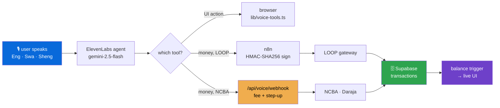

<div align="center">


# 🇰🇪 Ongea Pesa

### Say it. It's paid.

#### A voice-first Kenyan payments app that listens in English, Swahili and Sheng — and settles on real rails.

<sub><i>Built for the LOOP hackathon. LOOP runs against <b>sandbox</b> — see <a href="#-what-works--what-doesnt-yet">What works / What doesn't yet</a> before you believe anything below.</i></sub>

<br>

[](https://ongeapesa-ulh.nsait.co.ke)
[](#-the-loop-integration)
[](LICENSE)

[](https://nextjs.org/)
[](https://react.dev/)
[](https://www.typescriptlang.org/)
[](https://supabase.com/)
[](https://elevenlabs.io/)
[](https://livekit.io/)
[](https://n8n.io/)

</div>

---

## 😤 The problem

Sending money in Kenya works. It just doesn't work *while you're doing something else*.

Paying a matatu fare means: unlock, open the app or dial `*334#`, wade through
a menu tree, type a phone number you half-remember, type an amount, type a PIN,
wait, read a confirmation. Seven to twelve steps, two-odd minutes, and every
one of those typed digits is a chance to send KSh 5,000 to a stranger.

It is worse if you are older, if your eyes aren't good, if you're carrying
shopping, if you're on a boda, or if the menu is in a register of English you
don't use at home.

## 💡 What this is

**You talk. It pays.**

```
you  ▸ tuma elfu mbili kwa mum

ai   ▸ Two thousand shillings to Mum. Is she on LOOP, or should I
       send it to her M-Pesa?

you  ▸ M-Pesa

ai   ▸ Sending KSh 2,000 to Mum, 0722 xxx 118, on M-Pesa. Confirm?

you  ▸ ndio

     → tool call: loop_send_mpesa { amount: "2000", phone: "254722xxx118" }
     → n8n signs it (HMAC-SHA256), calls LOOP, writes the ledger row
     → transactions row: provider=loop, status=completed

ai   ▸ Done. Two thousand to Mum. Your balance is now eleven thousand,
       four hundred and twenty.
```

No menu. No typing. It asked which rail rather than guessing, and it read the
amount and the number back **before** moving anything — because a voice
interface that mishears is a voice interface that steals.

---

## ✅ What works / ❌ What doesn't yet

The single most useful section in this file. A demo that oversells itself wastes
your afternoon, so here is the honest split.

<table>
<tr><th width="50%">✅ Works, today, end to end</th><th width="50%">❌ Not yet — don't plan around it</th></tr>
<tr valign="top"><td>

- **Voice payments** in English, Swahili and Sheng, with tool calling
- **All 8 LOOP rails** wired as agent tools (send, pay, collect, enquire)
- **Scan-to-pay** — point the camera at a paybill, till, QR or receipt
- **Batch send** — *"send 500 to Jane, 1000 to Peter, pay Zuku 2000"*
- **Chama** — full rotating-savings lifecycle, bulk STK collection, B2C payout
- **Escrow** — two-party, multi-party, milestone and time-locked
- **PIN + WebAuthn passkeys** with lockout and single-use step-up tokens
- **RLS on all 22 tables**, plus a typed `security_events` audit trail
- **Admin dashboards** — revenue, costs, security events, LOOP config
- **PWA** — installs to the home screen, offline fallback

</td><td>

- **LOOP is SANDBOX.** `sandbox.loop.co.ke`, merchant till `133239`. **No real money moves over LOOP.** Production needs approved keys and a base-URL flip.
- **LOOP voice tools bypass the fee and step-up.** They POST straight to n8n, skipping `/api/voice/webhook` — where the platform fee, the free-transaction rule and step-up confirmation live. So LOOP payments carry **no platform fee and no step-up**. Fine for a sandbox demo; **must be closed before real money.** (`scripts/configure-loop-agent.mjs:22`)
- **Pochi la Biashara is deliberately unavailable** — rejected as "coming soon" in the webhook and in both agent prompts, rather than half-working.
- **`walletService.resolveRailAndSend()` computes LOOP fees but no route calls it.** The code is there; the wiring isn't.
- **Voice biometrics is spec'd, not shipped** (Phase 5). PIN and passkeys are real; a voiceprint does not authenticate anything today.
- **The n8n workflow is not in this repo** — see [below](#-a-note-on-what-lives-where).

</td></tr>
</table>

> [!IMPORTANT]
> **No biometric data ever leaves your device.**
> Passkeys use WebAuthn: your phone performs the Face/Touch ID match locally and
> hands back a signature. What we store is a **COSE public key** — a value that
> can verify a signature and nothing else. There is no face, no fingerprint, and
> no template on our servers, so there is nothing there to leak.

---

## 🏗️ How a spoken payment actually travels

<div align="center">


</div>



Note the fork at `which tool?` — that amber box is the whole of the honest
caveat above. NCBA payments pass through `/api/voice/webhook` and get fees and
step-up. LOOP payments currently don't.

### The two-balance model

**Read this before you read any transaction code.** It explains a class of bug
that otherwise looks like magic.

| Ledger | Where it lives | What it tracks |
| :--- | :--- | :--- |
| `profiles.wallet_balance` | Supabase Postgres | The internal wallet. A **DB trigger** debits/credits it. |
| IndexPay gate / pocket | IndexPay cloud | Chama and escrow fund custody, held separately. |

An external send inserts a `processing` row that **does not debit**. It debits
only when it flips to `completed`; a `failed` row never debits at all.

That is deliberate. Money that has left a rail but not yet been confirmed is in
a genuinely unknown state, and pretending otherwise is how you build a ledger
that silently disagrees with reality. Async results reconcile idempotently by
`provider_ref` / `conversation_id`, so a callback delivered twice settles once.

<div align="center">

</div>

### Payment rails

| Destination | Rail | Cost |
| :--- | :--- | :--- |
| 🟢 Ongea → Ongea | Internal Postgres RPC `process_internal_transfer` | **Free** |
| 📲 M-Pesa phone / paybill / till | NCBA Open Banking → n8n | NCBA fee |
| 🧾 Utility bills (KPLC, NHIF, NSSF, KRA…) | NCBA bill pay → n8n | NCBA fee |
| 🔄 Chama group payouts | Daraja B2C bulk → n8n | Daraja B2C fee |
| 🔵 **LOOP — wallet, M-Pesa, PesaLink, tills, paybills** | **LOOP gateway → n8n** | **sandbox** |

---

## 🔵 The LOOP integration

The reason this repo exists. Eight LOOP rails, each exposed to the voice agent
as a tool it can call mid-sentence.

### Live configuration

Mirrored in-app at **`/admin-analytics/loop`**, so a judge can verify it on the
deployed site rather than taking this file's word for it.

| | |
| :--- | :--- |
| **Environment** | 🟡 `SANDBOX` — no real money |
| **Base URL** | `https://sandbox.loop.co.ke` |
| **Merchant Till** | `133239` |
| **Signing** | HMAC-SHA256 · `merchantTill\|timestamp\|nonce` · lowercase hex |
| **Idempotency** | `txnReference` — a repeat is refused as a duplicate (`404`) |

### Spoken intent → tool → LOOP service

| You say… | Tool the agent calls | LOOP service |
| :--- | :--- | :--- |
| *"tuma kwa M-Pesa"* | `loop_send_mpesa` | `MRCHNT_SENDMONEY` |
| *"send inside LOOP"* | `loop_send_loop` | `MRCHNT_SENDMONEY` |
| *"send to my bank"* | `loop_send_pesalink` | `MRCHNT_SENDMONEY` |
| *"pay this LOOP till"* | `loop_pay_till` | `MRCHNT_PAYMENTS` |
| *"lipa na M-Pesa till"* | `loop_pay_mpesa_till` | `MRCHNT_PAYMENTS` |
| *"pay KPLC paybill"* | `loop_pay_paybill` | `MRCHNT_PAYMENTS` |
| *"top up my wallet"* | `loop_prompt` ⏳ **async** | `NEO_MRCHNT_RTP` |
| *"did that payment go through?"* | `loop_txn_inquiry` 👁️ read-only | `MRCHNT_TXN_INQUIRY` |

⏳ **async** matters. A LOOP Prompt is a *request to pay*: it pushes a prompt to
the customer's phone and the money arrives only once they approve. The row stays
`processing` until `loop_prompt_callback` fires. This is why
[`app/api/deposit/loop/route.ts`](app/api/deposit/loop/route.ts) returns a
`transaction_id` for the client to poll instead of a success flag — the balance
must rise when money **lands**, not when a prompt is **sent**.

### 💰 Four LOOP traps that cost real money

Every one of these is documented, and every one has bitten someone.

<table>
<tr valign="top"><td width="30">🚨</td><td>

**HTTP 200 does not mean success.**
The gateway returns `200` on failures too. `if (response.ok)` will happily
record failed payments as successful. Branch on **`statusCode` inside the body**.

</td></tr>
<tr valign="top"><td>💸</td><td>

**Retrying wrong pays twice.**
On a timeout, retry with the **same** `txnReference`. A fresh one can send the
money again. A "duplicate" rejection is *good news* — it means the first
attempt worked.

</td></tr>
<tr valign="top"><td>🔑</td><td>

**The docs say "RSA signing guide". It is not RSA.**
The real scheme is **HMAC-SHA256** with a shared secret. Go looking for a key
pair and you'll lose an afternoon.

</td></tr>
<tr valign="top"><td>📍</td><td>

**Signing fields go *inside* `requestParameters`.**
Not at the top level. A documented cause of a `400` with an unhelpful message.

</td></tr>
</table>

<sub>These come from the <a href="https://github.com/imodoiepale/unleashed-loop.dev-skill"><b>unleashed-loop.dev-skill</b></a> —
a companion project that gives an AI coding assistant the real LOOP docs so it
stops inventing endpoints. Its <code>references/signing.md</code> is the
authoritative spec, with all four of LOOP's test vectors recomputed and verified.</sub>

### 📍 A note on what lives where

**The n8n workflow is not in this repository.** The `loop Hackathon - Ongeapesa`
workflow — which holds the HMAC signing Code node, the rail routing and the
Supabase writes — lives on the n8n instance. This repo holds the app that calls
it: the agent configuration, the deposit route, the admin view, and the wallet
service. Saying so plainly saves you searching for a file that was never here.

---

## 🎙️ The voice stack

Two engines, one set of tools. **ElevenLabs is primary; self-hosted LiveKit is
the fallback.**

| | ElevenLabs *(default)* | Self-hosted LiveKit *(fallback)* |
| :--- | :--- | :--- |
| **LLM** | `gemini-2.5-flash` | `gpt-4o-mini` |
| **TTS** | `eleven_flash_v2` — ~75 ms to first byte | OpenAI `tts-1` |
| **STT** | `scribe_realtime` | Deepgram `nova-3` |
| **Runs on** | ElevenLabs' edge | one VPS in Nairobi |

Three of those four favour ElevenLabs and they compound — the difference is the
gap between a conversation and a walkie-talkie. The self-hosted path is kept,
not deleted: it works, it's the escape hatch for an outage, and any account can
be pinned to it with `profiles.voice_engine = 'livekit'`.

Both engines drive the **same six client tools**, defined once in
[`lib/voice-tools.ts`](lib/voice-tools.ts) — ElevenLabs reaches them via
`clientTools`, LiveKit via `room.registerRpcMethod`. One implementation, because
a behavioural difference between engines is a bug, not a feature.

| Tool | What it does |
| :--- | :--- |
| `open_scanner` | Opens the camera overlay without leaving the screen |
| `start_scan` | Starts a scan in a mode — auto, QR, receipt, paybill |
| `stage_payment` | Fills the on-screen Amount / To / Type slots **without sending** |
| `confirm_payment` | Triggers the mounted screen's confirm action |
| `read_balance` | Reads the wallet balance aloud in Kenyan format |
| `send_batch` | Dispatches several payments in one command, reads back per-item results |

`stage_payment` is the one worth noticing: the agent fills the confirmation
panel as it hears each field, so you *watch* the payment assemble and can stop
it before it goes. Speech is ambiguous — the UI is the receipt.

---

## 🧰 What else is in here

| Module | What it gives you |
| :--- | :--- |
| 📸 **Scan-to-Pay** | Camera auto-detects 9 payment types across paybills, tills, QR codes, receipts and bank slips. OpenAI `gpt-4o` primary, Gemini fallback. Torch, zoom, batch mode, and disambiguation when a document shows several targets. |
| 🔄 **Chama** | The full Kenyan merry-go-round: create, bulk-import members from device contacts or vCard/CSV, invite links, simultaneous STK collection, retries, rotation shuffle, B2C payout. → [`CHAMA_README.md`](CHAMA_README.md) |
| 🤝 **Escrow** | Two-party, multi-party, milestone and time-locked deals, with multi-sig, auto-release and disputes. → [`ESCROW_README.md`](ESCROW_README.md) |
| 💳 **Wallet** | Realtime balance, STK deposits, LOOP Prompt top-up, withdrawals, saved bills, scheduled payments. |
| 👥 **Contacts** | Native Android contact picker, vCard/CSV import elsewhere, fuzzy search, and Ongea-user detection so internal transfers route free. |
| 📊 **Admin** | Fifteen views — revenue, unit economics, transaction costs, security events, voice sessions, LOOP config, Sheng review queue. |
| 🗣️ **Sheng corpus** | A recording and review pipeline collecting Sheng audio to fine-tune ASR, because off-the-shelf models don't speak how Nairobi speaks. |

**Full feature reference: [`docs/FEATURES.md`](docs/FEATURES.md).**

---

## 🔐 Security

| Control | How it works |
| :--- | :--- |
| **PIN** | 4–6 digits, bcrypt cost 12. Only the hash is stored. |
| **Passkeys** | WebAuthn via `@simplewebauthn`. Device does the match; server stores a COSE public key. No biometric data server-side, ever. |
| **Lockout** | 5 failed attempts → 15-minute lock, `HTTP 423`. |
| **Step-up tokens** | Verifying PIN or passkey mints a **single-use, 5-minute** token. `/api/wallet/send`, `/api/wallet/withdraw` and `/api/voice/confirm/[id]` consume one before money moves. |
| **RLS** | Enabled on **all 22 tables**. Server routes use the service role; client routes are RLS-bound to `auth.uid()`. |
| **Audit** | Typed `security_events` on every sensitive action, plus row-change triggers into `audit_log`. |

Money-moving **voice** intents are staged into `pending_voice_payments` and
released only after in-app proof — a voice channel is an open microphone in a
public place, so speech alone should never be sufficient authorisation.

*(Re-read the ❌ column: LOOP tools currently skip this step-up gate.)*

---

## 🚀 Running it

```bash
git clone https://github.com/imodoiepale/ongeapesa-ulh.git
cd ongeapesa-ulh
npm install
```

Create `.env.local` — see [`env.example`](env.example) for the full list:

```env
# Supabase
NEXT_PUBLIC_SUPABASE_URL=https://your-project.supabase.co
NEXT_PUBLIC_SUPABASE_ANON_KEY=
SUPABASE_SERVICE_ROLE_KEY=

# Voice — ElevenLabs (primary)
NEXT_PUBLIC_AGENT_ID=            # the agent id; NEXT_PUBLIC_* is inlined at BUILD time
ELEVENLABS_API_KEY=

# Voice — LiveKit (self-hosted fallback)
LIVEKIT_URL=
LIVEKIT_API_KEY=
LIVEKIT_API_SECRET=

# Orchestration
N8N_WEBHOOK_BASE_URL=
N8N_CALLBACK_SECRET=

# Scanning, mail, admin
NEXT_PUBLIC_GEMINI_API_KEY=
RESEND_API_KEY=
ADMIN_EMAILS=
WEBAUTHN_RP_ID=
WEBAUTHN_ORIGIN=
```

Apply the migrations in [`database/migrations/`](database/migrations/) in
filename order, then:

```bash
npm run dev
```

<details>
<summary><b>Gotchas that will cost you an hour</b></summary>

<br>

- **`NEXT_PUBLIC_AGENT_ID` is inlined at build time.** Setting it and *not*
  redeploying leaves the old value baked into the bundle. The symptom is
  `{"error":"Agent ID not configured"}` from a deployment whose env vars look
  perfectly correct.
- **`npm run dev:pwa`** uses webpack instead of turbopack. Reach for it if
  turbopack misbehaves on Windows.
- **Vercel `sensitive` env vars are write-only.** You cannot read the value back
  through the dashboard *or* the API. If you're unsure what's in one, overwrite it.
- **Two `008_*` migrations exist.** Apply both. There is no `003`.

</details>

---

## 🇰🇪 New to Kenyan payments? Start here

No shame in this — the vocabulary is half the battle.

| Word | What it means |
| :--- | :--- |
| **M-Pesa** | Kenya's dominant mobile money service. For most people it *is* their bank. |
| **Till** | The number you pay when you "buy goods". Identifies a business. |
| **Paybill** | Like a till, but you also type an account number — your meter, an invoice. |
| **PesaLink** | The rail that moves money **between Kenyan banks** using a phone number. |
| **Chama** | A rotating savings group. Everyone contributes monthly; each month one member takes the pot. Enormous in Kenya, almost entirely run on WhatsApp and trust. |
| **Sheng** | Nairobi's Swahili-English street language. *"Elfu mbili"* = 2,000. *"Ngiri"* = 1,000. |
| **Pochi la Biashara** | A business wallet product. **Not supported here yet.** |
| **Sandbox** | A practice environment. Same behaviour, **fake money**. Always start here. |
| **Idempotency** | Making sure the same request sent twice doesn't pay twice. LOOP uses `txnReference`. |
| **Nonce** | A random one-time value proving a request is fresh, not a replay. Never reuse one. |
| **Step-up** | Re-proving it's really you — PIN or Face ID — right before money moves. |

> [!TIP]
> **Always build in sandbox first.** In production, payouts are **not reversible**.
> There is no undo.

---

## 📜 Licence & honesty

**MIT** — see [LICENSE](LICENSE).

This is a hackathon build. It is not an NCBA or LOOP product, and it is not
reviewed or endorsed by either. The LOOP integration runs against **sandbox**;
treat every number here as a demo figure until you have verified it against your
own account. For fees, limits, settlement and compliance, confirm with LOOP
directly at `apisupport@loop.co.ke`.

**Trademarks.** LOOP, NCBA, M-Pesa, Safaricom and their logos belong to their
respective owners. They are used here only to identify which rails this project
integrates with — nominative use, not a claim of affiliation or endorsement. The
MIT licence covers this project's own code, not those marks.

<br>

<div align="center">

<a href="https://nsait.co.ke">
  
</a>

### Created by [**NSAIT.CO.KE**](https://nsait.co.ke)

#### Nairobi Space of AI Tools

<sub>Built &amp; maintained by <a href="https://www.linkedin.com/in/jamesepale/"><b>Epale</b></a> &amp; <a href="https://www.linkedin.com/in/leo-chrisben-evans-a49570322/"><b>Chrisben</b></a></sub>

<br>

[](https://nsait.co.ke)
[](https://www.linkedin.com/in/jamesepale/)
[](https://github.com/imodoiepale)
[](https://www.linkedin.com/in/leo-chrisben-evans-a49570322/)
[](https://github.com/chrisleo-16)

<sub>Made in Nairobi 🇰🇪 · for everyone who'd rather just say it</sub>

<br>

⭐ **If this is useful, star the repo.**

</div>
